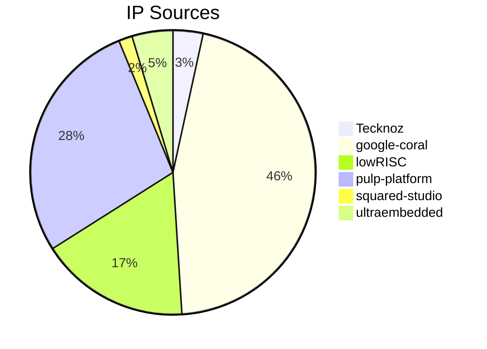

# Hyper-Titan SoC

## Overview

Hyper-Titan is an open-source dual-core RISC-V SoC built around a big-LITTLE style architecture: an RV64G Performance core for compute-heavy work and an RV32IMF Efficiency core for control-oriented tasks. It combines low-latency TCM, DMA-assisted data movement, and practical peripherals (UART/SPI) into a cohesive, research-friendly platform.

Hyper-Titan is designed as a “middle ground” SoC: more capable than typical microcontroller-class designs, while staying smaller and more approachable than full Linux-class platforms.

## Features

- **Big-LITTLE dual-core RISC-V**: Partition workloads between the RV64G Performance core and RV32IMF Efficiency core.
- **Low-latency TCM**: Fast shared memory for tight control loops and inter-core data exchange.
- **DMA-assisted transfers**: Move data between peripherals and memory with reduced CPU involvement.
- **Practical peripherals**: UART for bring-up/debug and SPI for external device connectivity.
- **Open-source RTL + docs**: A solid base for learning, experimentation, and customization.

## Why Hyper-Titan

- **Faster bring-up for ideas**: A complete SoC integration target (cores, memory, interconnect, peripherals) for rapid iteration in simulation.
- **Teachable architecture**: Clear separation of compute vs control roles and multiple clock domains for real-world SoC concepts.
- **Extensible baseline**: Add/replace peripherals, expand memory, and evolve the interconnect while keeping a working reference design.

## Ideal For

- RISC-V SoC exploration and architectural experiments
- Verification and system-level testbench development
- Firmware/driver bring-up against memory-mapped peripherals
- Research projects needing a modifiable dual-core baseline

## Architecture Overview

Hyper-Titan uses a dual-core architecture to balance performance and efficiency: the RV64G core targets compute-intensive workloads, while the RV32IMF core targets control-oriented tasks.

The diagram below shows the main blocks and how they connect. Each core runs in its own dedicated clock domain, enabling independent frequency scaling and power management.

Interconnect is organized into three links:

- **Core Link** connects the two cores to a common system bus and runs in the fastest clock domain of the two cores to minimize inter-core communication latency.
- **System Link** connects the cores to memory controllers and operates in its own clock domain.
- **Peripheral Link** connects peripherals (e.g., UART and SPI) and operates in its own clock domain. Since peripheral bandwidth requirements are typically lower than core bandwidth, the Peripheral Link runs at 100 MHz to conserve power.


_**Figure:** Hyper-Titan SoC Architecture_

### Key Components

- _Efficiency Core:_ RV32IMF core designed for low power consumption.
- _Performance Core:_ RV64G core optimized for high performance.
- _TCM Memory:_ Shared memories accessible by both cores for fast data exchange.
- _DMA Controller:_ Manages data transfers between different blocks.
- _Internal ROM:_ Read only memory for boot code and firmware.
- _External RAM:_ Connections for external DDR3 memory.
- _APB Bridge:_ Facilitates external access to the system bus.
- _System Controller:_ Manages system-level functions and configurations.
- _Clock & Reset Generator:_ Provides clock signals and reset functionality.
- _SPI Host:_ Serial Peripheral Interface for high-speed communication with external devices.
- _UART:_ Universal Asynchronous Receiver-Transmitter for serial communication.
- _CLINT:_ Core Local Interruptor for handling interrupts.
- _PLIC:_ Platform-Level Interrupt Controller for managing external interrupts.

#### [Detailed Architecture](document/detailed_architecture.md)

## Repository

This repository contains the complete RTL design, simulation testbenches, and documentation for the Hyper-Titan SoC.

**Repository Structure:**

```text
Hyper-Titan/
├── build/                 # Temporary build files
├── document/              # Documentation files
├── hardware/              # RTL source files and testbenches
│   ├── design/            # SoC design source files
│   ├── filelist/          # File lists for synthesis and simulation
│   ├── include/           # Common include files
│   ├── interface/         # Interface definitions
│   ├── package/           # Common packages
│   └── testbench/         # Testbenches for simulation
├── log/                   # Simulation logs and reports
├── software/              # Firmware and driver source code
│   ├── include/           # Common include files
│   ├── linkers/           # Linker scripts
│   └── source/            # Firmware and driver source files
├── submodule/             # External third-party dependencies
├── .gitmodules            # Git submodule configuration
├── LICENSE                # License information
├── Makefile               # Top-level Makefile for build automation
└── README.md              # Project overview
```

## Getting Started

**Pre-requisites:**

- A Unix-based development environment
- GNU Makefile
- GNU toolchain for RISC-V
- AMD Xilinx Vivado

## Third-Party Components

This project utilizes several third-party components, including:

- [google-coral/coralnpu](https://github.com/google-coral/coralnpu)
- [lowRISC/ariane](https://github.com/lowRISC/ariane)
- [pulp-platform/axi](https://github.com/pulp-platform/axi)
- [pulp-platform/common_cells](https://github.com/pulp-platform/common_cells)
- [squared-studio/common](https://github.com/squared-studio/common)
- [squared-studio/SoC](https://github.com/squared-studio/SoC)
- [ultraembedded/core_ddr3_controller](https://github.com/ultraembedded/core_ddr3_controller)

| _TODO:_ Add more as necessary



> Note: Pie chart rendering requires Mermaid support in your Markdown renderer.

## License

This project is licensed under the MIT License - see the [LICENSE](LICENSE) file for details.
